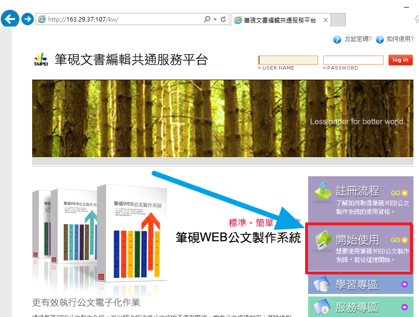
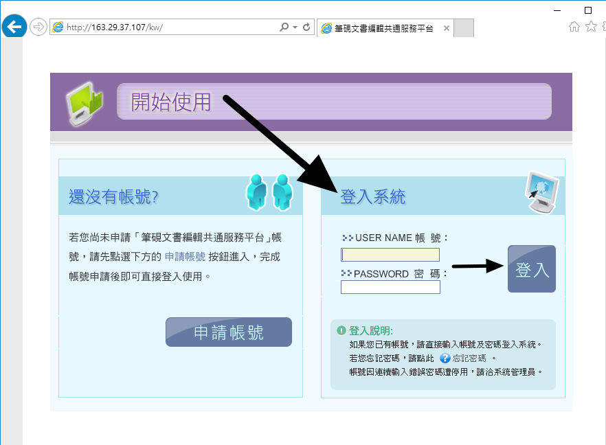
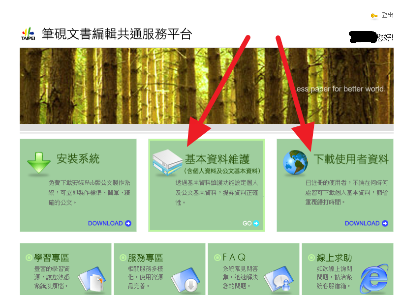

# 台北市公文製作系統安裝

by AlexW

## 測試環境 

* Windows 10 1067 企業版
* IE 11

## 安裝步驟

1. 右鍵以系統管理員執行 indtall_kw01.bat

2. 雙擊 install_kw02_登入下載個人資料.lnk 以 IE 連上[官網](http://163.29.37.107/kw/)

   1. 右側中下 開始使用

      

   2. 右側 打完帳密 登入(如未註冊請選左邊註冊帳號)

      

      ?

   3. 如無資料更動 請選右側下載使用者資料

      如有更動請選中間基本資料維護 儲存後再下載使用者資料)

      

      ?

3. 右鍵以系統管理員執行 install_kw03.bat (每次下載個人資料或是更動使用者資料必須做此動作)

4. 雙擊桌面的 "文書編輯-公文製作_IE32" 開始使用